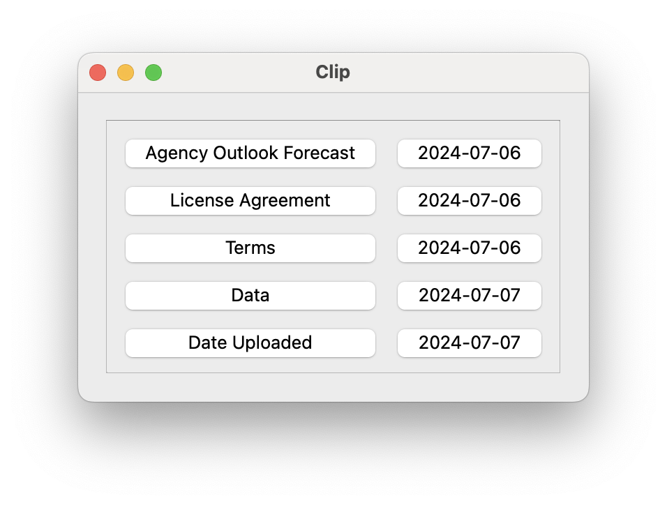

# clip

A GUI application written with Python Qt for managing a copy-and-paste clipboard.

I want a simple clipboard app that displays key/value pairs as adjacent buttons. When you click a button, the text associated with the button is copied to the OS clipboard. I looked at clipboard apps in the Apple AppStore, but they do not match my needs, so I built my own in a couple of hours.

Much of this code was generated by GitHub Copilot.

## Installation

I built this app with [Python](https://www.python.org/), [Poetry](https://python-poetry.org/), and [Qt](https://doc.qt.io/qtforpython-6/index.html). 

I have no intention to publish this to PyPI. It's a personal tool. But Poetry should make it easy to publish this if I change my mind.



## Usage

1. Create a data file with key/value pairs separated by space and pipe characters, similar to a Markdown table.
2. Start the app with `poetry run clip run <data file>`.
3. Click a button to copy the associated text to the OS clipboard.
4. Exit by clicking on the X icon.

```shell
poetry run clip run ~/path/to/data/file
```

### Example data file

```plaintext
Agency Outlook Forecast  | 2024-07-06
License Agreement        | 2024-07-06
Terms                    | 2024-07-06
Data                     | 2024-07-07
Date Uploaded            | 2024-07-07
```
